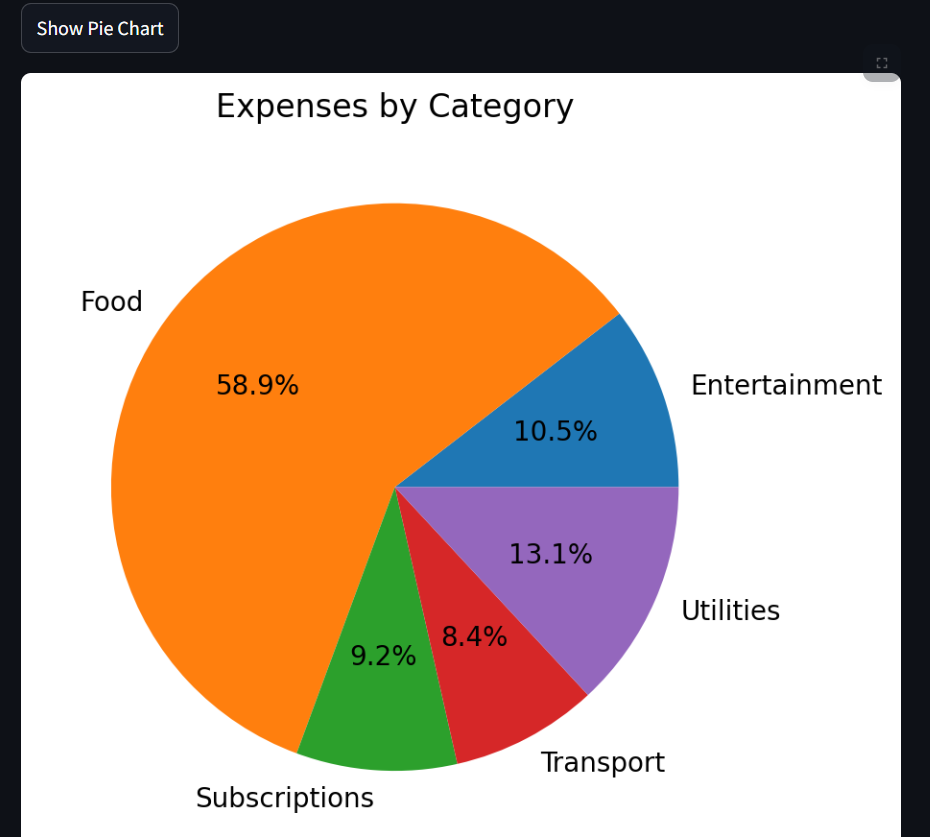

# SmartCents - Personal Finance Tracker & Advisor

SmartCents is a simple yet powerful personal finance tracking web app built with **Streamlit**.  
It helps users log expenses and income, visualize spending patterns, forecast future expenses, and receive personalized financial advice.

> _This project was done to improve my knowledge in AI, machine learning, data analysis, and software development using Python and Streamlit._

---

## Features

- Add and track expenses and income entries  
- View your overall financial summary: total income, total expenses, and savings  
- Visualize expenses by category (pie chart)  
- Track expenses over time (line chart)  
- Forecast expenses for the next day using linear regression  
- Get personalized savings advice based on spending habits  

---

## Technologies Used

- **Python**
- **Streamlit** 
- **Pandas** 
- **Matplotlib** & **Seaborn** 
- **scikit-learn** 

---

## Getting Started

### Prerequisites

Make sure you have Python 3 installed. Then install the required packages:

```bash
pip install streamlit pandas matplotlib seaborn scikit-learn
```

---

### Running the App

1. Place the `expenses.csv` file in the project folder (sample data shown below).
2. Run the Streamlit app:

```bash
streamlit run main.py
```

---

## Sample Data (`expenses.csv`)

```csv
Date,Category,Description,Amount
2025-05-01,Food,Grocery,40.50
2025-05-02,Transport,Bus ticket,3.00
2025-05-02,Entertainment,Netflix subscription,12.99
2025-05-03,Utilities,Electricity bill,25.00
2025-05-04,Food,Restaurant dinner,20.00
2025-05-05,Transport,Taxi ride,8.50
2025-05-06,Subscriptions,Spotify,9.99
2025-05-07,Income,Salary,100.00
```

---

## Usage & UI Overview

### 1. Add New Expense or Income
- Select a date
- Choose category (e.g., Food, Transport, Income, etc.)
- Add a brief description
- Enter the amount
- Click **"Add Entry"** to save it to the CSV file

### 2. Expense Overview
- Displays all your data in a table
- Shows total income, total expenses, and net savings

### 3. Visualization Buttons
- **Show Pie Chart**: Visualizes expense distribution by category
- **Show Line Chart**: Displays expense trends over time
- **Show Forecast**: Predicts next day’s expense amount using linear regression
- **Get Financial Advice**: Provides personalized advice based on spending patterns

---

## Screenshots

- Adding new entries form
  
  
- Expense overview table
  
  
  
- Pie chart visualization
  
  
- Line chart visualization
  
  
- Forecast and Advice output
  
  

---

## Future Features

- Monthly and yearly summary reports generation (PDF/Excel export)
- Multilingual support for global users
- Daily/weekly savings tips via notifications
- Optional cloud sync for data backup and cross-device access
- Password-protected login system for multiple users
- Calendar view for expense tracking
- Receipt/image upload and OCR to auto-fill expense fields
- Advanced AI financial advisor trained on user behavior

---

## Learning Outcome

This project was a practical journey to:

- Learn **Streamlit** for building web apps in Python  
- Understand and apply **data analysis techniques** using **Pandas**  
- Use **machine learning** for basic forecasting with **scikit-learn**  
- Improve skills in **visualization** with **Matplotlib** and **Seaborn**  
- Build an end-to-end data-driven tool  

---

> Thank you for checking out my project. Feedback is always welcome!
